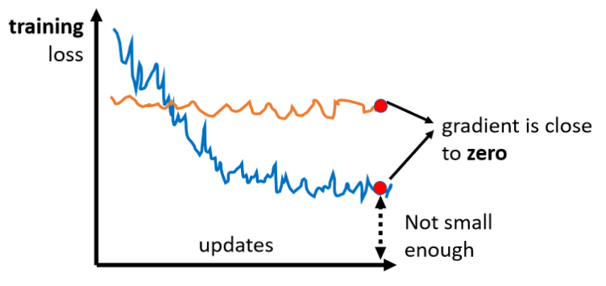
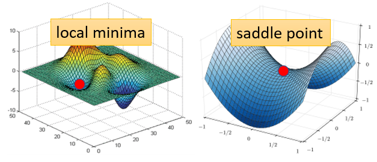
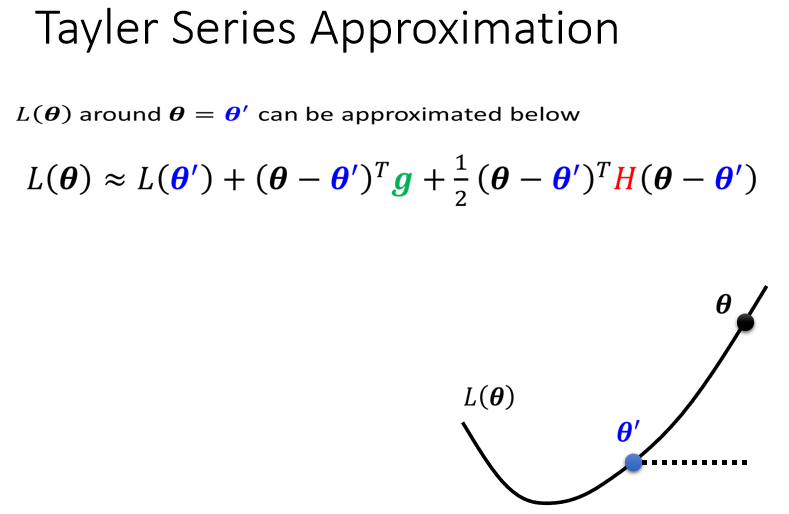
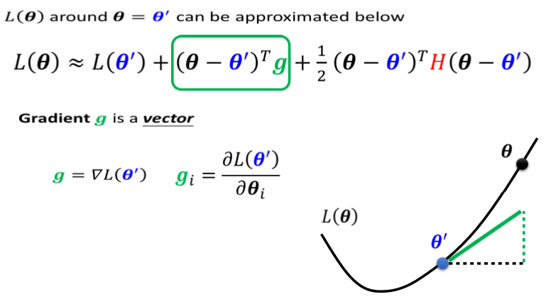
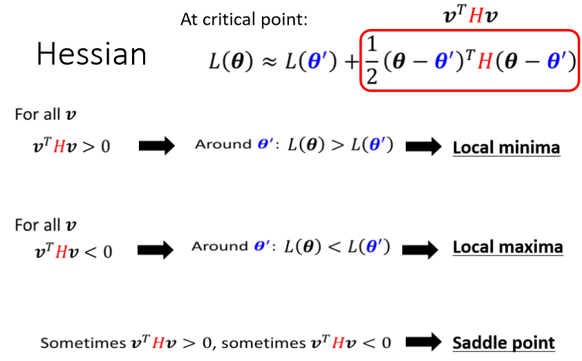

# 当gradient非常小导致模型优化进行不了时

## Reason

  

常常在做Optimization的时候会发现,随著参数不断的update,training的loss不会再下降,常见的一个猜想,是因为我们现在走到了一个地方,这个地方参数对loss的微分为零,当你的参数对loss微分为零的时候,gradient descent就没有办法再update参数了,这个时候training就停下来了,loss当然就不会再下降了。

  

不是只有**local minima**的gradient是零,还有其他可能会让gradient是零,比如说 **saddle point**,所谓的**saddle point**,其实就是gradient是零,但不是**local minima**,也不是**local maxima**的地方,像在右边这个例子里面红色的这个点,它在左右这个方向是比较高的,前后这个方向是比较低的,它就像是一个马鞍的形状,所以叫做saddle point,也就是鞍点。

所以当gradient非常接近0，卡在某个critical point上的时候，如何知道它是**local minimum**还是**saddle point**是一件非常重要的事情，因为如果是卡在**local minima**,那可能就没有路可以走了,但如果是**saddle point**，旁边其实还是可以找到gradient更低的点的。

-----

## So how to distinguish？

**Tayler Series Approximation**

  

$L(θ)$完整的样子写不出来,但是它在$θ'$附近,你可以用这个式子来表示它,这个式子是,Tayler Series Appoximation泰勒级数展开。

* 第一项是$L(θ')$,就告诉我们说,当$θ$趋近于$θ'$的时候,$L(θ)$应该跟$L(θ')$很接近。

* 第二项是$(θ-θ')^Tg$​ 

  

    
  

  **$g$是一个向量,这个g就是我们的gradient**,我们用绿色的这个g来代表gradient,这个**gradient会来弥补,$θ'$跟$θ$之间的差距**,我们虽然刚才说$θ'$跟$θ$,它们应该很接近,但是中间还是有一些差距的,那这个差距,第一项我们用这个gradient,来表示他们之间的差距,有时候gradient会写成$∇L(θ')$,这个地方的$g$是一个向量,**它的第i个component,就是θ的第i个component对L的微分**,光是看g还是没有办法,完整的描述L(θ),你还要看第三项

* 第三项跟Hessian有关,这边有一个$H $​

  

    
  

  这个$H$叫做Hessian,它是一个矩阵,这个第三项是,再$(θ-θ')^TH(θ-θ')$,所以第三项会再补足,再加上gradient以后,与真正的L(θ)之间的差距.**H裡面放的是L的二次微分**,**它第i个row,第j个column的值,就是把θ的第i个component,对L作微分,再把θ的第j个component,对L作微分,再把θ的第i个component,对L作微分,做两次微分以后的结果** 就是这个$H_i{_j}$

如果目前走到了一个critical point，意味著gradient為零,也就是绿色的这一项完全都不见了

  

$g$**是一个zero vector,绿色的这一项完全都不见了**,只剩下红色的这一项,所以当在critical point的时候,这个loss function,它可以被近似为$L(θ')$加上红色的这一项，我们可以**根据红色的这一项来判断**,在$θ'$附近的error surface,到底长什么样子，进而就能判断该点是一个**local minimum**还是**saddle point**。

方便起见，我们**把$(θ-θ')$用$v$这个向量来表示**

* 如果今天对任何可能的$v$**,$v^THv$都大于零**，那意味著说 $L(θ)>L(θ')$。$L(θ)$不管代多少 只要在$θ'$附近,$L(θ)$都大于$L(θ')$,**代表$L(θ')$是附近的一个最低点,所以它是local minima**
* 如果今天反过来说,对所有的$v$而言,**$v^THv$都小于零**,也就是说$θ$不管代表什么值,红色框框里面都小于零,意味著说$L(θ)<L(θ')$,**代表$L(θ')$是附近最高的一个点,所以它是local maxima**
* 第三个可能是假设,**$v^THv$,有时候大于零 有时候小于零**，意味著说在θ'附近,有时候L(θ)>L(θ') 有时候L(θ)<L(θ'),在L(θ')附近,有些地方高 有些地方低,**这意味着这是一个saddle point**

  

此外，线性代数告诉我们，如果今天对所有的v而言,$v^THv$都大于零,那这种矩阵叫做**positive definite 正定矩阵**,positive definite的矩阵,**它所有的eigen value特征值都是正的**。

所以如果你今天算出一个hessian,你不需要把它跟所有的v都乘看看,你只要去直接看这个H的**eigen value**

* **所有eigen value都是正的**,那就代表说这个条件成立,就$v^THv$,会大于零,也就代表说是一个local minima。
* 反过来说也是一样,如果今天在这个状况,对所有的v而言,$v^THv$小于零,那H是negative definite,那就代表所有**eigen value都是负的**,就保证他是local maxima
* **如果eigen value有正有负**,那就代表是saddle point

  

