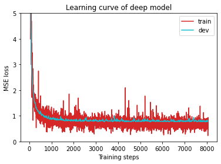
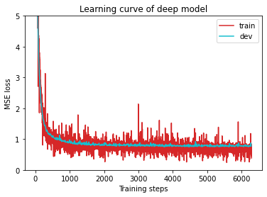
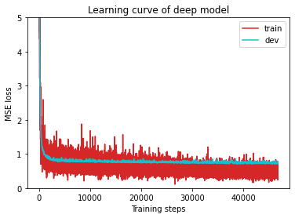
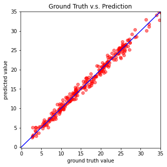
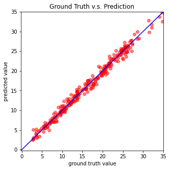
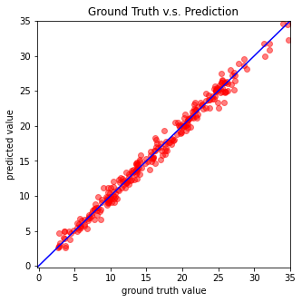

# HW1 - COVID19 Cases Prediction

提交人：李高杰

完成时间：2021/9/23

## 任务简介

HW1的主要任务就是搭建一个==Deep Neural Net==来预测确诊患者比例。例如：给定某3天的数据，其中包括了各项指标以及前两天的确诊患者比例，希望利用一个合适的DNN来预测第三天的确诊患者比例。

## 数据简介

* States(40, encoded to one-hot vectors)
  * e.g.AL, AK, AZ, ...
* COVID-like illness(4)
  * e.g.cli, ili(influenza-like illness), ...
* Behavior Indicators(8)
  * e.g.wearing_mask, travel_outside_state, ...
* Mental Health Indicators(5)
  * e.g. anxious, depressed, ...
* Tested Positive Cases(1)
  * ==tested_positive(this is what we want to predict)==

## 详细步骤

### Import Some Packages

```python
#Pytorch
import torch
import torch.nn as nn
from torch.utils.data import Dataset, DataLoader

#数据处理
import numpy as np
import csv
import os

#可视化
import matplotlib.pyplot as plt
from matplotlib.pyplot import figure
```

```python
myseed = 42069  # set a random seed for reproducibility
torch.backends.cudnn.deterministic = True 
#将上述flag置为True的话，每次返回的卷积算法将是确定的，即默认算法
torch.backends.cudnn.benchmark = False 
#上一行代码与卷积神经网络的速度有关 https://zhuanlan.zhihu.com/p/73711222
np.random.seed(myseed)
torch.manual_seed(myseed)
if torch.cuda.is_available():
    torch.cuda.manual_seed_all(myseed)
```

```python
tr_path = 'covid.train.csv'  # path to training data
tt_path = 'covid.test.csv'   # path to testing data
```

```python
def get_device():
    ''' Get device (if GPU is available, use GPU) '''
    return 'cuda' if torch.cuda.is_available() else 'cpu'

def plot_learning_curve(loss_record, title=''):
    ''' Plot learning curve of your DNN (train & dev loss) '''
    total_steps = len(loss_record['train'])
    x_1 = range(total_steps)
    x_2 = x_1[::len(loss_record['train']) // len(loss_record['dev'])]
    figure(figsize=(6, 4))
    plt.plot(x_1, loss_record['train'], c='tab:red', label='train')
    plt.plot(x_2, loss_record['dev'], c='tab:cyan', label='dev')
    plt.ylim(0.0, 5.)
    plt.xlabel('Training steps')
    plt.ylabel('MSE loss')
    plt.title('Learning curve of {}'.format(title))
    plt.legend()
    plt.show()


def plot_pred(dv_set, model, device, lim=35., preds=None, targets=None):
    ''' Plot prediction of your DNN '''
    if preds is None or targets is None:
        model.eval()
        preds, targets = [], []
        for x, y in dv_set:
            x, y = x.to(device), y.to(device)
            with torch.no_grad():
                pred = model(x)
                preds.append(pred.detach().cpu())
                targets.append(y.detach().cpu())
        preds = torch.cat(preds, dim=0).numpy()
        targets = torch.cat(targets, dim=0).numpy()

    figure(figsize=(5, 5))
    plt.scatter(targets, preds, c='r', alpha=0.5)
    plt.plot([-0.2, lim], [-0.2, lim], c='b')
    plt.xlim(-0.2, lim)
    plt.ylim(-0.2, lim)
    plt.xlabel('ground truth value')
    plt.ylabel('predicted value')
    plt.title('Ground Truth v.s. Prediction')
    plt.show()
```

### Preprocess

数据集一共有三份：

1. train：用于训练
2. dev：用于模型评估
3. test：用于测试模型性能

### Dataset

==COVID19Dataset==类做了以下事情：

1. read `.csv`files
2. extract features
3. split `covid.train.csv`into train/dev sets
4. normalize features

```python
class COVID19Dataset(Dataset):
    ''' Dataset for loading and preprocessing the COVID19 dataset '''
    def __init__(self,
                 path,
                 mode='train',
                 target_only=False):
        self.mode = mode

        # Read data into numpy arrays
        with open(path, 'r') as fp:
            data = list(csv.reader(fp))
            data = np.array(data[1:])[:, 1:].astype(float)
        
        if not target_only:
            feats = list(range(93))
        else:
            # TODO: Using 40 states & 2 tested_positive features (indices = 57 & 75)
            feats = feats = list(range(40))+[57,75]
            pass

        if mode == 'test':
            # Testing data
            # data: 893 x 93 (40 states + day 1 (18) + day 2 (18) + day 3 (17))
            data = data[:, feats]
            self.data = torch.FloatTensor(data)
        else:
            # Training data (train/dev sets)
            # data: 2700 x 94 (40 states + day 1 (18) + day 2 (18) + day 3 (18))
            target = data[:, -1]
            data = data[:, feats]
            
            # Splitting training data into train & dev sets
            if mode == 'train':
                indices = [i for i in range(len(data)) if i % 10 != 0]
            elif mode == 'dev':
                indices = [i for i in range(len(data)) if i % 10 == 0]
            
            # Convert data into PyTorch tensors
            self.data = torch.FloatTensor(data[indices])
            self.target = torch.FloatTensor(target[indices])

        # Normalize features (you may remove this part to see what will happen) 
        #特征标准化，因为各式特征的阈值可能相差很大
        self.data[:, 40:] = \
            (self.data[:, 40:] - self.data[:, 40:].mean(dim=0, keepdim=True)) \
            / self.data[:, 40:].std(dim=0, keepdim=True)

        self.dim = self.data.shape[1] #获取data的特征数量

        print('Finished reading the {} set of COVID19 Dataset ({} samples found, each dim = {})'
              .format(mode, len(self.data), self.dim))

    #获取某一特定的条目
    def __getitem__(self, index):
        # Returns one sample at a time
        if self.mode in ['train', 'dev']:
            # For training
            return self.data[index], self.target[index]
        else:
            # For testing (no target)
            return self.data[index]

    def __len__(self):
        # Returns the size of the dataset
        return len(self.data)
```

### DataLoader

> DataLoader所做的事情就是从一个给定的Dataset中取出所需要的批量数据batches。

```python
def prep_dataloader(path, mode, batch_size, n_jobs=0, target_only=False):
    ''' Generates a dataset, then is put into a dataloader. '''
    dataset = COVID19Dataset(path, mode=mode, target_only=target_only)  # Construct dataset
    dataloader = DataLoader(
        dataset, batch_size,
        shuffle=(mode == 'train'), drop_last=False,
        num_workers=n_jobs, pin_memory=True)                            # Construct dataloader
    return dataloader
#这里的shuffle是指如果是用来训练，那么从dataset需要随机
```

### Deep Neural Network

> ==NeuralNet==是一个用于回归的==nn.Module==模型。本次构造的DNN由两个使用ReLU激活的全连层组成，当然可以进一步对网络的构造进行优化，由于本人刚刚入门Deep Learning，并未对网络的结构进行优化升级。同时，模型中使用cal_loss函数来计算loss。

```python
class NeuralNet(nn.Module):
    ''' A simple fully-connected deep neural network '''
    def __init__(self, input_dim):
        super(NeuralNet, self).__init__()

        # Define your neural network here
        # TODO: How to modify this model to achieve better performance?
        self.net = nn.Sequential(
            nn.Linear(input_dim, 32), 
        #原始中间这层神经元的个数是64，但是本次任务量级不是很大，用32足矣，训练后的结果也能说明同样的问题
            nn.ReLU(),
            nn.Linear(32, 1)
        )

        # Mean squared error loss
        self.criterion = nn.MSELoss(reduction='mean')

    def forward(self, x):
        ''' Given input of size (batch_size x input_dim), compute output of the network '''
        return self.net(x).squeeze(1)

    def cal_loss(self, pred, target):
        ''' Calculate loss '''
        # TODO: you may implement L2 regularization here
        alpha = 1e-4 
        regularization_loss = torch.tensor(0.0,requires_grad = False)
        for name,parma in self.named_parameters(): #torch.nn.model.named_parameters()给出了网络层的名字和参数的迭代器
            if 'bias' not in name:
                regularization_loss += (0.5*alpha * torch.sum(torch.pow(parma,2)))
        regularization_loss /= 2500
        return self.criterion(pred, target)+regularization_loss
```

### Train

```python
def train(tr_set, dv_set, model, config, device):
    ''' DNN training '''

    n_epochs = config['n_epochs']  # Maximum number of epochs

    # Setup optimizer
    optimizer = getattr(torch.optim, config['optimizer'])(
        model.parameters(), **config['optim_hparas'])

    min_mse = 1000.
    loss_record = {'train': [], 'dev': []}      # for recording training loss
    early_stop_cnt = 0
    epoch = 0
    while epoch < n_epochs:
        model.train()                           # set model to training mode
        for x, y in tr_set:                     # iterate through the dataloader
            optimizer.zero_grad()               # set gradient to zero
            x, y = x.to(device), y.to(device)   # move data to device (cpu/cuda)
            pred = model(x)                     # forward pass (compute output)
            mse_loss = model.cal_loss(pred, y)  # compute loss
            mse_loss.backward()                 # compute gradient (backpropagation)
            optimizer.step()                    # update model with optimizer
            loss_record['train'].append(mse_loss.detach().cpu().item())

        # After each epoch, test your model on the validation (development) set.
        dev_mse = dev(dv_set, model, device)
        if dev_mse < min_mse:
            # Save model if your model improved
            min_mse = dev_mse
            print('Saving model (epoch = {:4d}, loss = {:.4f})'
                .format(epoch + 1, min_mse))
            torch.save(model.state_dict(), config['save_path'])  # Save model to specified path
            early_stop_cnt = 0
        else:
            early_stop_cnt += 1

        epoch += 1
        loss_record['dev'].append(dev_mse)
        if early_stop_cnt > config['early_stop']:
            # Stop training if your model stops improving for "config['early_stop']" epochs.
            break

    print('Finished training after {} epochs'.format(epoch))
    return min_mse, loss_record
```

### Validation

```python
def dev(dv_set, model, device):
    model.eval()                                # set model to evalutation mode
    total_loss = 0
    for x, y in dv_set:                         # iterate through the dataloader
        x, y = x.to(device), y.to(device)       # move data to device (cpu/cuda)
        with torch.no_grad():                   # disable gradient calculation
            pred = model(x)                     # forward pass (compute output)
            mse_loss = model.cal_loss(pred, y)  # compute loss
        total_loss += mse_loss.detach().cpu().item() * len(x)  # accumulate loss
    total_loss = total_loss / len(dv_set.dataset)              # compute averaged loss

    return total_loss
```

### Testing

```python
def test(tt_set, model, device):
    model.eval()                                # set model to evalutation mode
    preds = []
    for x in tt_set:                            # iterate through the dataloader
        x = x.to(device)                        # move data to device (cpu/cuda)
        with torch.no_grad():                   # disable gradient calculation
            pred = model(x)                     # forward pass (compute output)
            preds.append(pred.detach().cpu())   # collect prediction
    preds = torch.cat(preds, dim=0).numpy()     # concatenate all predictions and convert to a numpy array
    return preds
```

### Setup Hyper-parameters

> ==config==里面包含了模型训练会涉及到的所有模型以及保存最终模型的路径

```python
device = get_device()                 # get the current available device ('cpu' or 'cuda')
os.makedirs('models', exist_ok=True)  # The trained model will be saved to ./models/
target_only = True                   # TODO: Using 40 states & 2 tested_positive features

# TODO: How to tune these hyper-parameters to improve your model's performance?
config = {
    'n_epochs': 5000,                # maximum number of epochs
    'batch_size': 200,#300 100       # mini-batch size for dataloader
    'optimizer': 'SGD',              # optimization algorithm (optimizer in torch.optim)
    'optim_hparas': {                # hyper-parameters for the optimizer (depends on which optimizer you are using)
        'lr': 0.001,#0.0005          # learning rate of SGD
        'momentum': 0.9              # momentum for SGD
    },
    'early_stop': 200,               # early stopping epochs (the number epochs since your model's last improvement)
    'save_path': 'models/model.pth'  # your model will be saved here
}
```

### Start Training

```python
model_loss, model_loss_record = train(tr_set, dv_set, model, config, device)
```

* 当batch_size设置为==200==，lr为0.001时，训练结果如下

```markdown
Saving model (epoch =    1, loss = 47.4422)
Saving model (epoch =    2, loss = 25.6593)
Saving model (epoch =    3, loss = 14.7840)
Saving model (epoch =    4, loss = 8.1151)
Saving model (epoch =    5, loss = 5.7142)
Saving model (epoch =    6, loss = 4.6696)
Saving model (epoch =    7, loss = 3.9586)
Saving model (epoch =    8, loss = 3.4213)
Saving model (epoch =    9, loss = 3.0309)
Saving model (epoch =   10, loss = 2.6923)
Saving model (epoch =   11, loss = 2.4615)
Saving model (epoch =   12, loss = 2.3176)
Saving model (epoch =   13, loss = 2.1136)
Saving model (epoch =   14, loss = 1.9811)
Saving model (epoch =   15, loss = 1.8450)
Saving model (epoch =   16, loss = 1.7700)
Saving model (epoch =   17, loss = 1.6864)
Saving model (epoch =   18, loss = 1.6351)
Saving model (epoch =   19, loss = 1.5306)
Saving model (epoch =   20, loss = 1.4979)
Saving model (epoch =   23, loss = 1.3733)
Saving model (epoch =   24, loss = 1.3116)
Saving model (epoch =   26, loss = 1.2591)
Saving model (epoch =   28, loss = 1.2494)
Saving model (epoch =   29, loss = 1.2336)
Saving model (epoch =   30, loss = 1.1876)
Saving model (epoch =   31, loss = 1.1773)
Saving model (epoch =   33, loss = 1.1643)
Saving model (epoch =   34, loss = 1.1317)
Saving model (epoch =   35, loss = 1.1078)
Saving model (epoch =   36, loss = 1.0840)
Saving model (epoch =   40, loss = 1.0746)
Saving model (epoch =   43, loss = 1.0318)
Saving model (epoch =   44, loss = 1.0098)
Saving model (epoch =   51, loss = 0.9627)
Saving model (epoch =   52, loss = 0.9588)
Saving model (epoch =   55, loss = 0.9434)
Saving model (epoch =   59, loss = 0.9297)
Saving model (epoch =   62, loss = 0.9264)
Saving model (epoch =   63, loss = 0.9114)
Saving model (epoch =   65, loss = 0.8948)
Saving model (epoch =   70, loss = 0.8865)
Saving model (epoch =   71, loss = 0.8840)
Saving model (epoch =   73, loss = 0.8614)
Saving model (epoch =   79, loss = 0.8601)
Saving model (epoch =   89, loss = 0.8441)
Saving model (epoch =   94, loss = 0.8366)
Saving model (epoch =   97, loss = 0.8250)
Saving model (epoch =  119, loss = 0.8169)
Saving model (epoch =  121, loss = 0.8158)
Saving model (epoch =  122, loss = 0.8077)
Saving model (epoch =  125, loss = 0.8018)
Saving model (epoch =  131, loss = 0.8018)
Saving model (epoch =  145, loss = 0.7910)
Saving model (epoch =  163, loss = 0.7892)
Saving model (epoch =  180, loss = 0.7741)
Saving model (epoch =  262, loss = 0.7709)
Saving model (epoch =  332, loss = 0.7703)
Saving model (epoch =  338, loss = 0.7701)
Saving model (epoch =  344, loss = 0.7681)
Saving model (epoch =  354, loss = 0.7670)
Saving model (epoch =  419, loss = 0.7609)
Finished training after 620 epochs
```

* 当batch_size设置为==300==，lr为0.001的时候，训练结果如下

```markdown
Saving model (epoch =    1, loss = 160.3957)
Saving model (epoch =    2, loss = 31.1744)
Saving model (epoch =    3, loss = 23.6392)
Saving model (epoch =    4, loss = 17.5460)
Saving model (epoch =    5, loss = 12.3026)
Saving model (epoch =    6, loss = 9.0978)
Saving model (epoch =    7, loss = 6.8664)
Saving model (epoch =    8, loss = 5.6407)
Saving model (epoch =    9, loss = 4.8952)
Saving model (epoch =   10, loss = 4.3487)
Saving model (epoch =   11, loss = 3.9349)
Saving model (epoch =   12, loss = 3.5976)
Saving model (epoch =   13, loss = 3.3870)
Saving model (epoch =   14, loss = 3.0738)
Saving model (epoch =   15, loss = 2.9763)
Saving model (epoch =   16, loss = 2.7044)
Saving model (epoch =   17, loss = 2.5912)
Saving model (epoch =   18, loss = 2.3894)
Saving model (epoch =   19, loss = 2.2496)
Saving model (epoch =   20, loss = 2.1183)
Saving model (epoch =   21, loss = 2.0792)
Saving model (epoch =   22, loss = 1.9795)
Saving model (epoch =   23, loss = 1.8526)
Saving model (epoch =   24, loss = 1.7815)
Saving model (epoch =   25, loss = 1.6889)
Saving model (epoch =   26, loss = 1.6500)
Saving model (epoch =   27, loss = 1.6076)
Saving model (epoch =   28, loss = 1.6021)
Saving model (epoch =   29, loss = 1.5050)
Saving model (epoch =   30, loss = 1.4686)
Saving model (epoch =   31, loss = 1.4346)
Saving model (epoch =   33, loss = 1.4148)
Saving model (epoch =   34, loss = 1.3981)
Saving model (epoch =   35, loss = 1.3211)
Saving model (epoch =   36, loss = 1.2910)
Saving model (epoch =   37, loss = 1.2513)
Saving model (epoch =   41, loss = 1.2198)
Saving model (epoch =   42, loss = 1.1736)
Saving model (epoch =   43, loss = 1.1720)
Saving model (epoch =   46, loss = 1.1423)
Saving model (epoch =   48, loss = 1.1361)
Saving model (epoch =   51, loss = 1.1268)
Saving model (epoch =   52, loss = 1.1242)
Saving model (epoch =   53, loss = 1.0902)
Saving model (epoch =   54, loss = 1.0842)
Saving model (epoch =   56, loss = 1.0535)
Saving model (epoch =   61, loss = 1.0419)
Saving model (epoch =   62, loss = 1.0322)
Saving model (epoch =   64, loss = 1.0271)
Saving model (epoch =   65, loss = 1.0251)
Saving model (epoch =   66, loss = 0.9906)
Saving model (epoch =   71, loss = 0.9763)
Saving model (epoch =   80, loss = 0.9633)
Saving model (epoch =   86, loss = 0.9209)
Saving model (epoch =   94, loss = 0.9179)
Saving model (epoch =   98, loss = 0.8969)
Saving model (epoch =  103, loss = 0.8946)
Saving model (epoch =  107, loss = 0.8729)
Saving model (epoch =  115, loss = 0.8652)
Saving model (epoch =  119, loss = 0.8648)
Saving model (epoch =  120, loss = 0.8643)
Saving model (epoch =  122, loss = 0.8470)
Saving model (epoch =  129, loss = 0.8401)
Saving model (epoch =  133, loss = 0.8319)
Saving model (epoch =  138, loss = 0.8239)
Saving model (epoch =  151, loss = 0.8178)
Saving model (epoch =  160, loss = 0.8149)
Saving model (epoch =  167, loss = 0.8100)
Saving model (epoch =  180, loss = 0.7921)
Saving model (epoch =  192, loss = 0.7907)
Saving model (epoch =  210, loss = 0.7884)
Saving model (epoch =  234, loss = 0.7878)
Saving model (epoch =  242, loss = 0.7857)
Saving model (epoch =  249, loss = 0.7836)
Saving model (epoch =  259, loss = 0.7788)
Saving model (epoch =  263, loss = 0.7690)
Saving model (epoch =  303, loss = 0.7604)
Saving model (epoch =  385, loss = 0.7598)
Saving model (epoch =  416, loss = 0.7560)
Saving model (epoch =  419, loss = 0.7512)
Saving model (epoch =  498, loss = 0.7426)
Finished training after 699 epochs
```

* 当batch_size为100，lr为0.0005时，训练结果如下

```markdown
Saving model (epoch =    1, loss = 44.0982)
Saving model (epoch =    2, loss = 14.1045)
Saving model (epoch =    3, loss = 8.9617)
Saving model (epoch =    4, loss = 6.4622)
Saving model (epoch =    5, loss = 4.9410)
Saving model (epoch =    6, loss = 4.0617)
Saving model (epoch =    7, loss = 3.5047)
Saving model (epoch =    8, loss = 3.0944)
Saving model (epoch =    9, loss = 2.7790)
Saving model (epoch =   10, loss = 2.4750)
Saving model (epoch =   11, loss = 2.2492)
Saving model (epoch =   12, loss = 2.0575)
Saving model (epoch =   13, loss = 1.8772)
Saving model (epoch =   14, loss = 1.7276)
Saving model (epoch =   15, loss = 1.6098)
Saving model (epoch =   16, loss = 1.5516)
Saving model (epoch =   17, loss = 1.5068)
Saving model (epoch =   18, loss = 1.4018)
Saving model (epoch =   19, loss = 1.3558)
Saving model (epoch =   20, loss = 1.3277)
Saving model (epoch =   21, loss = 1.3226)
Saving model (epoch =   22, loss = 1.2674)
Saving model (epoch =   23, loss = 1.2095)
Saving model (epoch =   25, loss = 1.1844)
Saving model (epoch =   27, loss = 1.1549)
Saving model (epoch =   28, loss = 1.1118)
Saving model (epoch =   32, loss = 1.0917)
Saving model (epoch =   33, loss = 1.0789)
Saving model (epoch =   35, loss = 1.0409)
Saving model (epoch =   36, loss = 1.0271)
Saving model (epoch =   39, loss = 0.9770)
Saving model (epoch =   42, loss = 0.9750)
Saving model (epoch =   44, loss = 0.9742)
Saving model (epoch =   45, loss = 0.9698)
Saving model (epoch =   49, loss = 0.9678)
Saving model (epoch =   50, loss = 0.9637)
Saving model (epoch =   51, loss = 0.9585)
Saving model (epoch =   52, loss = 0.9340)
Saving model (epoch =   54, loss = 0.9187)
Saving model (epoch =   57, loss = 0.9028)
Saving model (epoch =   59, loss = 0.9015)
Saving model (epoch =   61, loss = 0.8915)
Saving model (epoch =   63, loss = 0.8898)
Saving model (epoch =   65, loss = 0.8858)
Saving model (epoch =   68, loss = 0.8728)
Saving model (epoch =   71, loss = 0.8616)
Saving model (epoch =   74, loss = 0.8582)
Saving model (epoch =   76, loss = 0.8482)
Saving model (epoch =   87, loss = 0.8230)
Saving model (epoch =  100, loss = 0.8221)
Saving model (epoch =  102, loss = 0.8205)
Saving model (epoch =  107, loss = 0.8191)
Saving model (epoch =  114, loss = 0.7942)
Saving model (epoch =  132, loss = 0.7929)
Saving model (epoch =  133, loss = 0.7902)
Saving model (epoch =  145, loss = 0.7873)
Saving model (epoch =  146, loss = 0.7832)
Saving model (epoch =  148, loss = 0.7800)
Saving model (epoch =  151, loss = 0.7779)
Saving model (epoch =  220, loss = 0.7696)
Saving model (epoch =  233, loss = 0.7674)
Saving model (epoch =  237, loss = 0.7664)
Saving model (epoch =  330, loss = 0.7661)
Saving model (epoch =  349, loss = 0.7646)
Saving model (epoch =  354, loss = 0.7630)
Saving model (epoch =  436, loss = 0.7562)
Saving model (epoch =  446, loss = 0.7468)
Saving model (epoch =  542, loss = 0.7420)
Saving model (epoch =  599, loss = 0.7414)
Saving model (epoch =  718, loss = 0.7383)
Saving model (epoch =  793, loss = 0.7332)
Saving model (epoch =  925, loss = 0.7312)
Saving model (epoch = 1056, loss = 0.7300)
Saving model (epoch = 1148, loss = 0.7294)
Saving model (epoch = 1165, loss = 0.7274)
Saving model (epoch = 1182, loss = 0.7265)
Saving model (epoch = 1283, loss = 0.7201)
Saving model (epoch = 1390, loss = 0.7193)
Saving model (epoch = 1459, loss = 0.7131)
Saving model (epoch = 1490, loss = 0.7104)
Saving model (epoch = 1547, loss = 0.7052)
Saving model (epoch = 1578, loss = 0.7047)
Saving model (epoch = 1669, loss = 0.6998)
Finished training after 1870 epochs
```

```python
plot_learning_curve(model_loss_record, title='deep model')
```



<div align = "center"><b>batch_size_200,lr_0.001</b></div>




<div align = "center"><b>batch_size_300,lr_0.001</b></div>



<div align = "center"><b>batch_size_100,lr_0.0005</b></div>

```python
del model
model = NeuralNet(tr_set.dataset.dim).to(device)
ckpt = torch.load(config['save_path'], map_location='cpu')  # Load your best model
model.load_state_dict(ckpt)
plot_pred(dv_set, model, device)  # Show prediction on the validation set
```



<div align = "center"><b>batch_size_200,lr_0.001</b></div>




<div align = "center"><b>batch_size_300,lr_0.001</b></div>



<div align = "center"><b>batch_size_100,lr_0.0005</b></div>

> 对比前两个模型，两者学习率相同，batsize_300的模型最终得到的loss要比200小，然而当batch_size为100时候，loss却也要比两者低，为0.7227（710 epochs），同时若将学习率再降低的话，loss还能降到0.6998.
>
> 对于此模型，可能batchsize大小设置在100-200之间可能会比较好，尽管可能更大（>300）的batchsize也能达到同样的loss，但是大的batchsize往往会带来一些其他的问题。

### Testing

The predictions of your model on testing set will be stored at `pred.csv`.

```python
def save_pred(preds, file):
    ''' Save predictions to specified file '''
    print('Saving results to {}'.format(file))
    with open(file, 'w') as fp:
        writer = csv.writer(fp)
        writer.writerow(['id', 'tested_positive'])
        for i, p in enumerate(preds):
            writer.writerow([i, p])

preds = test(tt_set, model, device)  # predict COVID-19 cases with your model
save_pred(preds, 'pred.csv')         # save prediction file to pred.csv
```

```markdown
Saving results to pred.csv
```

## 总结

> DNN的基本轮廓及核心主要是以下三个方面：

**1. ** **数据**

数据是关键所在，它能够让我们感知应该如何搭建合适的网络结构，应该如何从中挑选合适的特征，或是如何调节某些相关的超参数。它也是我们训练模型，验证模型，测试模型的唯一材料。

**2. ** **网络结构以及Loss Function**

DNN的构成在很大程度上能够决定整个模型的好坏，当然这也是基于不同的问题而言，优质的网络能够针对问题给出更好的结果，能够更加快速高效。有时，哪怕一些细微的改动，也能带来很大的影响。

**3. ** **优化器**

模型是在训练过程中不断迭代成长的，优化器的任务就是能够更好更快的让模型在给定的训练数据上更新换代，不断变强。

***

> 本次作业中，我初次接触到了pytorch这一深度学习狂框架，在查阅资料中初步熟悉了它内置的一些类及方法。目前训练得到的模型效果还不太令人满意，在我继续学习Deep Learning之后，我会返过头来从网络结构以及特征提取，还有超参数的调节方面进一步优化代码。


## 问题归纳

* **What is Random Seed**

A random seed is used to ensure that results are reproducible. In other words, using this parameter makes sure that anyone who re-runs your code will get the exact same outputs. Reproducibility is an extremely important concept in data science and other fields.

